# Для старта:<br>
  ## Для psycopg2<br>
  python3 -m venv venv;<br>
  source venv/bin/activate;

  pip install psycopg2-binary:
---
  ## Для SQLite
  ```python
  create db into folder SQLite_test
  connection = sqlite3.connect('SQLite_test/sqlite_python.db')
  cursor = connection.cursor()

  cursor.execute('''CREATE TABLE taxi_yellow(
          VendorID INTEGER,
          tpep_pickup_datetime TIMESTAMP,                          
          tpep_dropoff_datetime TIMESTAMP,   
          passenger_count INTEGER,                  
          trip_distance FLOAT,  
          RatecodeID INTEGER,
          store_and_fwd_flag varchar(10),
          PULocationID varchar(1000),           
          DOLocationID varchar(1000),                                    
          payment_type INTEGER,                       
          fare_amount FLOAT,                      
          extra FLOAT,                          
          mta_tax FLOAT,   
          tip_amount FLOAT,  
          tolls_amount FLOAT,
          improvement_surcharge FLOAT,                                        
          total_amount FLOAT,                     
          congestion_surcharge FLOAT,            
          airport_fee FLOAT);
          ''')

  file = open('path to csv')
  contents = csv.reader(file)
  insert_records = "INSERT INTO taxi_yellow (VendorID, tpep_pickup_datetime, tpep_dropoff_datetime, passenger_count, trip_distance, RatecodeID, store_and_fwd_flag, PULocationID, DOLocationID, payment_type, fare_amount, extra, mta_tax, tip_amount, tolls_amount, improvement_surcharge, total_amount, congestion_surcharge, airport_fee) VALUES(?, ?, ?, ?, ?, ?, ?, ?, ?, ?, ?, ?, ?, ?, ?, ?, ?, ?, ?)"
  cursor.executemany(insert_records, contents)
```
<br>

## Для DuckDB
  pip install duckdb<br>
  for create bd<br>

```python 
  conn = duckdb.connect('DuckDB_test/DuckDB.duckdb')
  cursor = conn.cursor()
  cursor.execute("CREATE TABLE taxi AS SELECT * FROM read_csv_auto('path to csv');")
```
<br>

## Для pandas
  pip insall pandas<br>
  Also need create local bd and use connection - SQLite or SQLAlchemy.

---

## Для sqlalchemy
  pip install sqlalchemy

  Подключить к BD, я выбрал postgesql
  
Write a benchmark to measure the speed of execution of all four queries from the benchmark 4 queries.

В данной лабараторной было выполнено по 20 запросов для каждой библиотеки.

# psycopg2 (Postgress)
  ## 1 query
  AVERAGE=215.717506408691<br>
  <br>

  ## 2 query
  AVERAGE=288.943600654602 <br>
  <br>

  ## 3 query
  AVERAGE=635.384798049927 <br>
  <br>

  ## 4 query
  AVERAGE=687.97470331192 <br>
  <br>

  <br>
---
# SQLite 
  ## 1 query
  AVERAGE=670.306479930878<br>
  <br>

  ## 2 query
  AVERAGE=1125.99264383316<br>
  <br>

  ## 3 query
  AVERAGE=1981.75443410873<br>
  <br>

  ## 4 query
  AVERAGE=2989.81219530106<br>
  <br>

  <br>
---
# DuckDB
  ## 1 query
  AVERAGE=29.1940331459045<br>
  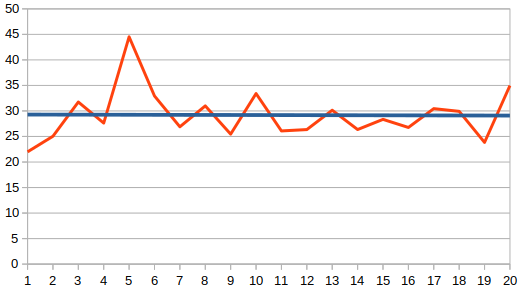<br>

  ## 2 query
  AVERAGE=40.7169580459595<br>
  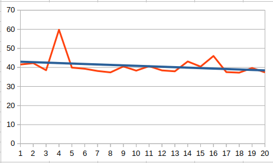<br>

  ## 3 query
  AVERAGE=106.645703315735<br>
  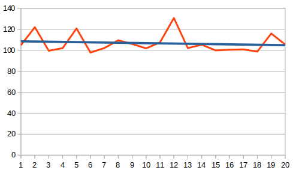<br>

  ## 4 query
  AVERAGE=141.297197341919<br>
  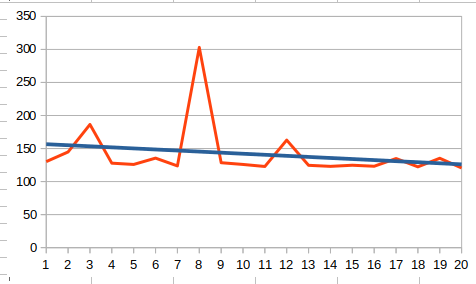<br>

  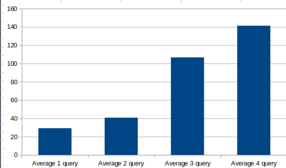
---
# Pandas
 ## 1 query 
  AVERAGE=608.37984085083<br>
  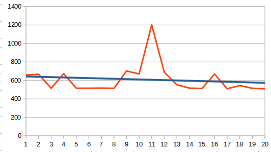<br>

 ## 2 query
  AVERAGE=982.764136791229<br>
  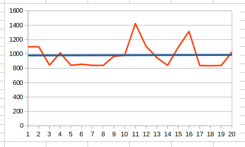<br>

 ## 3 query
  AVERAGE=1669.82358694077<br>
  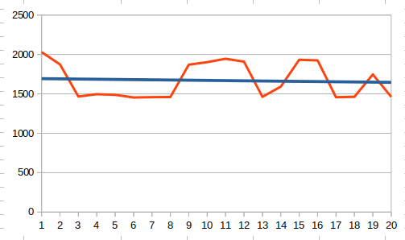<br>

 ## 4 query
  AVERAGE=2431.83189630508<br>
  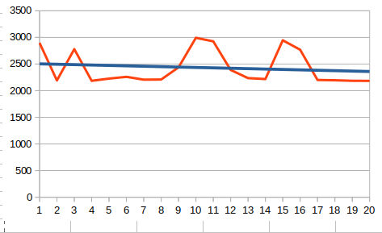<br>

  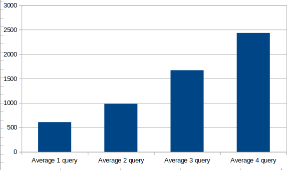<br>
---

# SQLAlchemy
 ## 1 query
  AVERAGE=281.095612049103<br>
  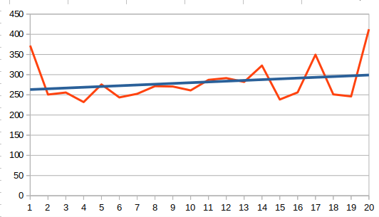<br>

 ## 2 query
  AVERAGE=339.094614982605<br>
  <br>

 ## 3 query
  AVERAGE=700.636959075928<br>
  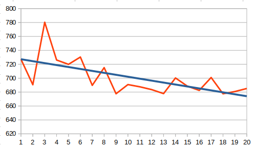<br>

 ## 4 query
  AVERAGE=770.026981830597<br>
  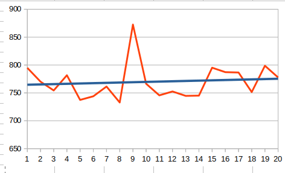<br>

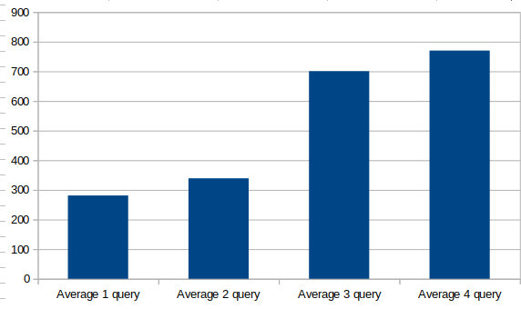<br>

# Выводы

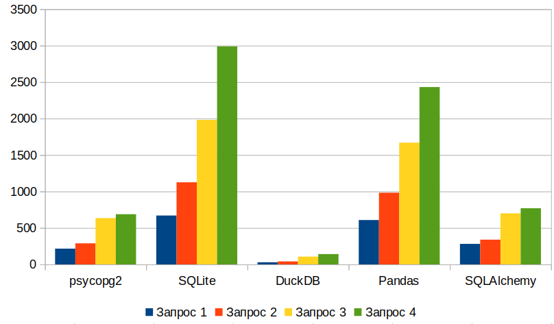
Для проведения лабараторной работы было выбрано 5 библиотек(psycopg2, SQLite, DuckDB, Pandas, SQLAlchemy), для работы с BD. В ходе выполнения работы, были собраны данные - время работы. Всего для каждой библиотеки было задействовано 4 запроса. Каждый запрос повторялся 20 раз, исходя из полученных данных, были сделаный графики и найдено среднее время. Подводя итог проделанной работы, мною были получены данные о том, что самой быстрой стал DuckDB по всем запросам. Самой долго работующей SQLite. psycopg2 и SQLAlchemy в среднем были одинаковы. По удобству использывания, могу сказать, что psycopg2, DuckDB больше понравились. 


# Приложение с временем работы каждой библотеки(20 запросов). 

# psycopg2 (Postgress)
  ### Working time 4 request<br>
  1 =  [243.6385154724121, 275.46072006225586, 223.04987907409668, 186.8724822998047, 194.36001777648926, 307.6286315917969, 264.30487632751465, 195.89972496032715, 212.21041679382324, 201.44891738891602, 187.07275390625, 195.82700729370117, 215.2688503265381, 187.94846534729004, 193.74942779541016, 184.2207908630371, 200.81067085266113, 202.9101848602295, 230.85570335388184, 210.81209182739258] 

  2 =  [289.8540496826172, 290.24314880371094, 273.9410400390625, 321.43354415893555, 283.6649417877197, 279.5579433441162, 280.36952018737793, 286.221981048584, 286.23414039611816, 281.1431884765625, 302.31404304504395, 274.871826171875, 289.4270420074463, 292.60969161987305, 334.8653316497803, 292.7687168121338, 278.44977378845215, 279.30188179016113, 283.6177349090576, 277.9824733734131] 

  3 =  [649.0573883056641, 627.1722316741943, 631.2322616577148, 623.4405040740967, 628.6695003509521, 641.0317420959473, 626.9195079803467, 621.9274997711182, 631.65283203125, 623.7063407897949, 649.6903896331787, 625.7290840148926, 660.6190204620361, 633.8176727294922, 629.683256149292, 622.1346855163574, 650.6297588348389, 656.6822528839111, 639.136791229248, 634.763240814209] 

  4 =  [687.633752822876, 686.4669322967529, 676.0632991790771, 683.6743354797363, 686.6278648376465, 687.2365474700928, 683.1533908843994, 680.9906959533691, 753.8738250732422, 684.9443912506104, 668.6446666717529, 684.5111846923828, 704.2160034179688, 683.3908557891846, 687.9465579986572, 672.3005771636963, 677.706241607666, 702.0096778869629, 675.2736568450928, 692.8296089172363] 

# SQLite <br>
  ### Working time 4 request<br>
  1 =  [683.234691619873, 672.1911430358887, 670.607328414917, 667.3862934112549, 1027.8897285461426, 610.5527877807617, 669.0404415130615, 658.4367752075195, 703.676700592041, 650.2511501312256, 876.5954971313477, 821.3138580322266, 652.2889137268066, 518.4123516082764, 680.5973052978516, 661.7276668548584, 507.3831081390381, 509.3045234680176, 662.9698276519775, 502.2695064544678] 

  2 =  [1387.2191905975342, 1120.3882694244385, 1094.3713188171387, 1122.018814086914, 1466.3004875183105, 1093.6822891235352, 1093.5754776000977, 1114.8405075073242, 1453.160047531128, 1284.8091125488281, 1108.3543300628662, 1183.351993560791, 1307.4719905853271, 875.6358623504639, 1104.6857833862305, 1102.2007465362549, 837.4788761138916, 835.4041576385498, 1096.245288848877, 838.658332824707] 

  3 =  [1942.0714378356934, 1945.94407081604, 1947.9827880859375, 1959.0513706207275, 2030.6119918823242, 1945.7406997680664, 1928.7288188934326, 1956.2702178955078, 2285.511255264282, 2085.66951751709, 1995.8605766296387, 2635.032892227173, 2628.150224685669, 1485.4843616485596, 2084.4385623931885, 1931.3807487487793, 1468.7163829803467, 1589.507818222046, 1942.5053596496582, 1846.4295864105225] 

  4 =  [2915.4703617095947, 3024.82533454895, 2946.7923641204834, 3912.4655723571777, 2798.940658569336, 3130.4643154144287, 3345.2062606811523, 3789.755344390869, 3007.877826690674, 2999.232053756714, 3119.215965270996, 3625.080347061157, 2768.8469886779785, 2647.6471424102783, 2931.5390586853027, 2809.354543685913, 2187.0241165161133, 2549.879789352417, 2399.665117263794, 2886.960744857788] 

# DuckDB <br>
### Working time 4 request<br>
  1 =  [21.99578285217285, 25.046825408935547, 31.75497055053711, 27.625560760498047, 44.5253849029541, 32.9282283782959, 26.89814567565918, 30.98917007446289, 25.45952796936035, 33.41197967529297, 26.084184646606445, 26.354551315307617, 30.147314071655273, 26.357650756835938, 28.35536003112793, 26.766061782836914, 30.455350875854492, 29.9222469329834, 23.836135864257812, 34.966230392456055] 

  2 =  [41.5341854095459, 42.2513484954834, 38.53893280029297, 59.77320671081543, 39.919376373291016, 39.312124252319336, 38.13624382019043, 37.41168975830078, 40.52257537841797, 38.33365440368652, 40.65704345703125, 38.449764251708984, 37.96696662902832, 43.1368350982666, 40.433406829833984, 46.01645469665527, 37.5523567199707, 37.26840019226074, 39.70623016357422, 37.418365478515625] 

  3 =  [104.81572151184082, 121.96660041809082, 99.55000877380371, 101.95755958557129, 120.75591087341309, 97.80716896057129, 102.07915306091309, 109.48705673217773, 105.94558715820312, 101.81689262390137, 107.43522644042969, 130.72800636291504, 102.07867622375488, 105.28445243835449, 99.87115859985352, 100.46744346618652, 100.80313682556152, 98.69909286499023, 115.91911315917969, 105.44610023498535] 

  4 =  [130.1896572113037, 144.81043815612793, 186.44285202026367, 127.83551216125488, 125.91028213500977, 135.50257682800293, 123.65865707397461, 303.09438705444336, 128.53384017944336, 125.8845329284668, 122.83849716186523, 162.79172897338867, 124.5887279510498, 122.99394607543945, 124.73344802856445, 123.19302558898926, 134.8271369934082, 122.32756614685059, 135.24651527404785, 120.54061889648438]

# Pandas <br>
### Working time 4 request<br>
1 =  [658.7193012237549, 666.7025089263916, 515.4433250427246, 673.0771064758301, 515.4409408569336, 515.5544281005859, 516.772985458374, 514.4326686859131, 702.2016048431396, 670.1478958129883, 1200.8757591247559, 689.0072822570801, 552.6046752929688, 516.6962146759033, 512.3598575592041, 668.8992977142334, 509.8860263824463, 544.1727638244629, 515.1798725128174, 509.42230224609375] 

2 =  [1100.3339290618896, 1100.1636981964111, 844.5291519165039, 1015.0313377380371, 841.825008392334, 857.2487831115723, 841.2704467773438, 840.1257991790771, 967.3178195953369, 981.0354709625244, 1422.9373931884766, 1105.320930480957, 949.5272636413574, 840.623140335083, 1093.7283039093018, 1313.4486675262451, 838.1950855255127, 836.174488067627, 839.3702507019043, 1027.0757675170898] 

3 =  [2030.0300121307373, 1874.1254806518555, 1466.2275314331055, 1496.1755275726318, 1488.2583618164062, 1454.1661739349365, 1458.0168724060059, 1460.0532054901123, 1870.5840110778809, 1902.759075164795, 1945.5225467681885, 1908.9264869689941, 1462.4581336975098, 1592.4746990203857, 1932.5313568115234, 1924.633502960205, 1457.4248790740967, 1462.6169204711914, 1746.8903064727783, 1462.5966548919678] 

4 =  [2896.836519241333, 2191.920280456543, 2779.8216342926025, 2185.321807861328, 2226.670026779175, 2259.48429107666, 2206.7928314208984, 2209.8586559295654, 2437.7152919769287, 2993.018865585327, 2926.161289215088, 2389.112949371338, 2236.0754013061523, 2217.8525924682617, 2945.7149505615234, 2768.754243850708, 2201.068878173828, 2195.207357406616, 2185.4379177093506, 2183.812141418457] 

# SQLAlchemy <br>
### Working time 4 request<br>
1 =  [372.0240592956543, 250.66542625427246, 255.7363510131836, 232.0249080657959, 275.71964263916016, 243.55101585388184, 252.50601768493652, 271.4252471923828, 270.60461044311523, 260.96367835998535, 287.0674133300781, 291.40591621398926, 282.0124626159668, 322.56555557250977, 238.38376998901367, 256.01720809936523, 349.4133949279785, 251.082181930542, 246.12021446228027, 412.62316703796387] 

2 =  [317.48175621032715, 306.25414848327637, 335.80946922302246, 408.5721969604492, 327.47697830200195, 328.963041305542, 333.25958251953125, 381.6874027252197, 352.8127670288086, 380.7954788208008, 320.157527923584, 353.421688079834, 319.20719146728516, 321.58708572387695, 328.1691074371338, 337.615966796875, 318.84312629699707, 327.43072509765625, 330.0433158874512, 352.30374336242676] 

3 =  [727.2579669952393, 690.6046867370605, 780.2884578704834, 726.0868549346924, 719.8808193206787, 730.3502559661865, 689.7110939025879, 715.1510715484619, 677.6154041290283, 690.8004283905029, 687.6194477081299, 683.5815906524658, 677.8473854064941, 700.3111839294434, 688.5437965393066, 682.4824810028076, 700.9716033935547, 677.626371383667, 680.8149814605713, 685.1933002471924] 

4 =  [794.8894500732422, 770.2088356018066, 754.399299621582, 781.6238403320312, 737.4534606933594, 743.9572811126709, 761.3897323608398, 732.8259944915771, 872.5550174713135, 766.4682865142822, 745.6011772155762, 752.521276473999, 744.6877956390381, 745.1174259185791, 795.1798439025879, 787.1904373168945, 786.6041660308838, 751.4679431915283, 798.6767292022705, 777.721643447876] 