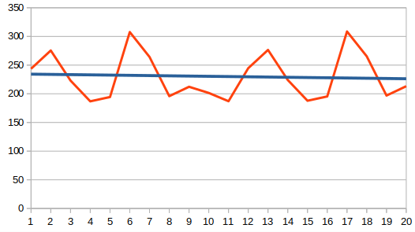
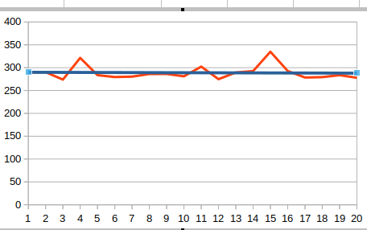
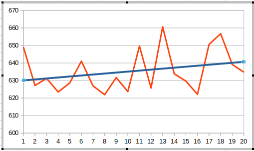
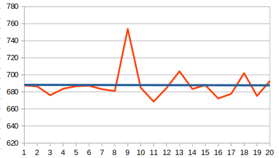
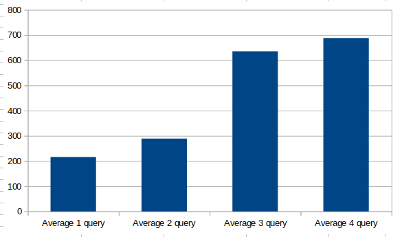
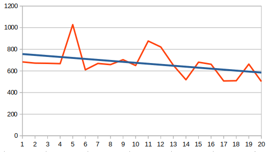
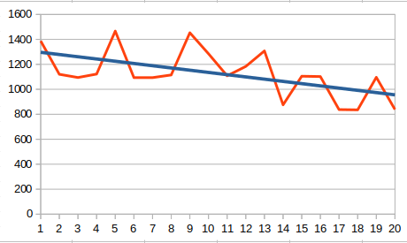
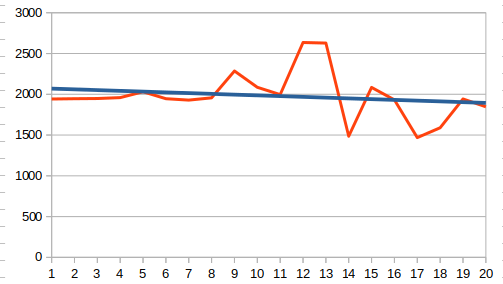
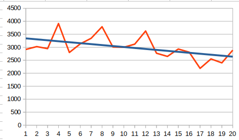
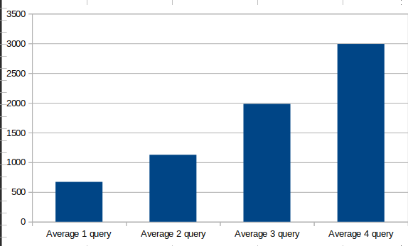

# For start application need: 
  ## For psycopg2 
  python3 -m venv venv; 
  source venv/bin/activate; 
  pip install psycopg2-binary: 
---
  ## For SQLite
  create db into folder SQLite_test
  connection = sqlite3.connect('SQLite_test/sqlite_python.db')
  cursor = connection.cursor()

  cursor.execute('''CREATE TABLE taxi_yellow(
          VendorID INTEGER,
          tpep_pickup_datetime TIMESTAMP,                          
          tpep_dropoff_datetime TIMESTAMP,   
          passenger_count INTEGER,                  
          trip_distance FLOAT,  
          RatecodeID INTEGER,
          store_and_fwd_flag varchar(10),
          PULocationID varchar(1000),           
          DOLocationID varchar(1000),                                    
          payment_type INTEGER,                       
          fare_amount FLOAT,                      
          extra FLOAT,                          
          mta_tax FLOAT,   
          tip_amount FLOAT,  
          tolls_amount FLOAT,
          improvement_surcharge FLOAT,                                        
          total_amount FLOAT,                     
          congestion_surcharge FLOAT,            
          airport_fee FLOAT);
          ''')

  file = open('path to csv')
  contents = csv.reader(file)
  insert_records = "INSERT INTO taxi_yellow (VendorID, tpep_pickup_datetime, tpep_dropoff_datetime, passenger_count, trip_distance, RatecodeID, store_and_fwd_flag, PULocationID, DOLocationID, payment_type, fare_amount, extra, mta_tax, tip_amount, tolls_amount, improvement_surcharge, total_amount, congestion_surcharge, airport_fee) VALUES(?, ?, ?, ?, ?, ?, ?, ?, ?, ?, ?, ?, ?, ?, ?, ?, ?, ?, ?)"
  cursor.executemany(insert_records, contents)
---

Write a benchmark to measure the speed of execution of all four queries from the benchmark 4 queries.

20 iterations were performed in each experiment.
---
# psycopg2 (Postgress)

  ### Working time 4 request 
  1 =  [243.6385154724121, 275.46072006225586, 223.04987907409668, 186.8724822998047, 194.36001777648926, 307.6286315917969, 264.30487632751465, 195.89972496032715, 212.21041679382324, 201.44891738891602, 187.07275390625, 195.82700729370117, 215.2688503265381, 187.94846534729004, 193.74942779541016, 184.2207908630371, 200.81067085266113, 202.9101848602295, 230.85570335388184, 210.81209182739258] 

  2 =  [289.8540496826172, 290.24314880371094, 273.9410400390625, 321.43354415893555, 283.6649417877197, 279.5579433441162, 280.36952018737793, 286.221981048584, 286.23414039611816, 281.1431884765625, 302.31404304504395, 274.871826171875, 289.4270420074463, 292.60969161987305, 334.8653316497803, 292.7687168121338, 278.44977378845215, 279.30188179016113, 283.6177349090576, 277.9824733734131] 

  3 =  [649.0573883056641, 627.1722316741943, 631.2322616577148, 623.4405040740967, 628.6695003509521, 641.0317420959473, 626.9195079803467, 621.9274997711182, 631.65283203125, 623.7063407897949, 649.6903896331787, 625.7290840148926, 660.6190204620361, 633.8176727294922, 629.683256149292, 622.1346855163574, 650.6297588348389, 656.6822528839111, 639.136791229248, 634.763240814209] 

  4 =  [687.633752822876, 686.4669322967529, 676.0632991790771, 683.6743354797363, 686.6278648376465, 687.2365474700928, 683.1533908843994, 680.9906959533691, 753.8738250732422, 684.9443912506104, 668.6446666717529, 684.5111846923828, 704.2160034179688, 683.3908557891846, 687.9465579986572, 672.3005771636963, 677.706241607666, 702.0096778869629, 675.2736568450928, 692.8296089172363] 

  ## 1 query  
  AVERAGE=215.717506408691 
   
  ## 2 query  
  AVERAGE=288.943600654602  
   
  ## 3 query  
  AVERAGE=635.384798049927  
   
  ## 4 query  
  AVERAGE=687.97470331192  
   

   
---
# SQLite  
  ### Working time 4 request 

  1 =  [683.234691619873, 672.1911430358887, 670.607328414917, 667.3862934112549, 1027.8897285461426, 610.5527877807617, 669.0404415130615, 658.4367752075195, 703.676700592041, 650.2511501312256, 876.5954971313477, 821.3138580322266, 652.2889137268066, 518.4123516082764, 680.5973052978516, 661.7276668548584, 507.3831081390381, 509.3045234680176, 662.9698276519775, 502.2695064544678] 

  2 =  [1387.2191905975342, 1120.3882694244385, 1094.3713188171387, 1122.018814086914, 1466.3004875183105, 1093.6822891235352, 1093.5754776000977, 1114.8405075073242, 1453.160047531128, 1284.8091125488281, 1108.3543300628662, 1183.351993560791, 1307.4719905853271, 875.6358623504639, 1104.6857833862305, 1102.2007465362549, 837.4788761138916, 835.4041576385498, 1096.245288848877, 838.658332824707] 

  3 =  [1942.0714378356934, 1945.94407081604, 1947.9827880859375, 1959.0513706207275, 2030.6119918823242, 1945.7406997680664, 1928.7288188934326, 1956.2702178955078, 2285.511255264282, 2085.66951751709, 1995.8605766296387, 2635.032892227173, 2628.150224685669, 1485.4843616485596, 2084.4385623931885, 1931.3807487487793, 1468.7163829803467, 1589.507818222046, 1942.5053596496582, 1846.4295864105225] 

  4 =  [2915.4703617095947, 3024.82533454895, 2946.7923641204834, 3912.4655723571777, 2798.940658569336, 3130.4643154144287, 3345.2062606811523, 3789.755344390869, 3007.877826690674, 2999.232053756714, 3119.215965270996, 3625.080347061157, 2768.8469886779785, 2647.6471424102783, 2931.5390586853027, 2809.354543685913, 2187.0241165161133, 2549.879789352417, 2399.665117263794, 2886.960744857788] 

  ## 1 query  
  AVERAGE=670.306479930878 
   
  ## 2 query  
  AVERAGE=1125.99264383316 
   
  ## 3 query  
  AVERAGE=1981.75443410873 
   
  ## 4 query  
  AVERAGE=2989.81219530106 
   

   
---